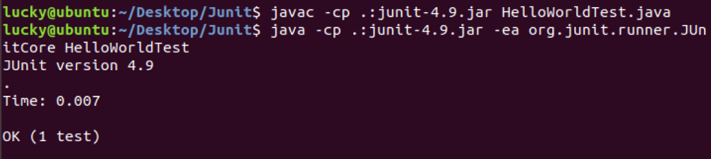

# Vi, Java, Ant, Junit 自学报告  
## Vi/Vim学习  
- Vi 编辑器是一个基于命令行的、功能强大的文本编辑器，最早为 Unix 系统开发，后来也被移植到许多的 Unix 和 Linux 发行版上。Vim是Vi的一个高阶版本，添加了以下的功能：  
   - 支持多种编程语言，包括python、c++、perl等语言的代码块折叠以及语法高亮
   - 支持通过多种网络协议，包括 http、ssh 等编辑文件
   - 支持编辑压缩归档中的文件
   - 支持分屏同时编辑多个文件  
- Vi编辑器的模式  
   - 命令模式  
   此模式下，可以执行保存文件、在 Vi 内运行命令、复制/剪切/粘贴操作，以及查找/替换等任务
   - 插入模式  
   在命令模式下，按i进入插入模式，该模式可以键入文件内容。按ESC返回命令模式  
- Vi的基本命令（命令模式下使用）  
先通过命令"vi 'filename'"创建名称为filename的文件（如果文件存在，则编辑已有文件）  
   - :w  保存文件  
   - :w filename  保存到filename文件  
   - :q  退出编辑器  
   - :q!  退出编辑器但不保存
   - :wq  退出编辑器同时保存  
- 编辑文本（在命令模式下）  
   - i 在光标前插入；
   - I 在行首插入；
   - a 在光标后插入；
   - A 在行尾插入；
   - o 在当前光标所在行之后添加一行； 
   - O 在当前光标所在行之前添加一行。
   - dd 删除光标所在的整行内容，在 dd 前添加数字可以删除多行（向后）
   - d$ 删除光标行及以后的所有行
   - d^ 删除光标行及之前的所有行
   - yy 复制当前行，在 yy 前添加数字可以复制多行
   - y$ 复制光标行及之后的内容
   - y^ 复制光标行及之前的内容
   - p 在光标之后粘贴复制行
   - P 在光标之前粘贴复制行
   - u 撤销上一步操作
   - U 撤销对当前行的所有操作
- 跳行命令（命令模式下使用）  
因为Vi编辑器不能使用鼠标让光标到指定位置，所以跳行的命令能加快文本的编辑（在这之前，可以先通过指令":set nu"显示文本的行号，通过命令":set nonu"取消行号的显示）  
   - n+ 向下跳n行
   - n- 向上跳n行
   - nG 跳到第n行
   - G 跳至文件底部
- 小结  
说实话，在用惯了像Sublime这样方便的编辑器之后，vi属实是太麻烦了，实现一些功能要安装各种的插件，并且各种快捷键的使用完全没有鼠标来的方便，尤其是代码的编辑。只能说vi适用于C++,python,html,script等语言环境，比用传统的一个环境配一个IDE的方式要高效吧。  
## Java学习  
- java的安装和环境配置由于在之前就已经弄好了（本地和云桌面都如此），所以就不在给出过程了。  
- java的初步学习  
这一部分实在不知道怎么写才好，要说java的东西还是特别多的，但一些基本的在之前都已经学过了，也没啥好写的。其他的写也写不完，所以就谈一谈这一次简单计算器涉及到的Swing的基本知识吧（包名：javax.swing.*）。参考：https://www.yiibai.com/swing  
   - 首先是一些基本的类  
      - JTextField：允许编辑单行文本的组件。此次用到的构造函数是JTextField(String text)，即使用指定文本初始化TextFielld
      - JLabel类：显示文本或图像。通过在显示区域中设置垂直和水平对齐来对齐标签的内容。默认情况下，标签在显示区域中垂直居中，纯文本标签前沿对齐，仅图像标签水平居中。此次用到的构造函数为JLabel(String text),即使用指定文本初始化Label。
      - JButton：按钮，可以有文本或者图像标签，按下时发生指定事件。此次用到的构造函数是JButton(String text)，可以创建一个有指定文本的Button。  
      - JFrame：
   - 其他一些函数  
      - void setText(String text)：定义此组件将显示的单行文本  
      - String getText()：返回标签显示的文本字符串
      - getActionCommand()：
      - void actionPerformed(ActionEvent e)：
      - setSize()：
      - setLayout():
      - setDefaultCloseOperation()：
      - setVisible()：
      - void setHorizontalAlignment(int alignment)：设置标签内容沿x方向对齐  
      - void addActionListener()：
   - Pattern库：可以用来定义一个正则规则，用于判定一个字符串是否代表数字，下面是这次简单计算器的例子  
     
- 简单java程序HelloWorld的测试  
    - 程序内容  
      
      
    - 进入程序所在的目录，在终端通过命令"javac HelloWorld.java"编译得到".class"文件，再通过命令"java HelloWorld"运行程序  
      
- 小结  
这部分的小结就列一些我在实验中遇到的一些需要注意的地方吧
   - java和javac版本要保持一致  
   - 在终端用"java"运行java类时，在找jdk时，可能不会找系统的默认环境（apt中的，也就是"java -version"命令寻找的环境，这一点我感觉很奇怪），所以要单独设置一个环境变量（或者在编译的时候加上jdk的路径）。这里我始终是没弄明白，虽然最后问题解决了，但关于环境变量的问题我还是存在疑惑（好像整个阶段一都充满了环境方面的问题，代码实现倒不是很难）。  
      
## Ant学习  
- 首先是ant的安装以及环境配置（本地环境：ubuntu18）  
    - 直接去官网上下载相应的压缩包  
      
      
    - 然后解压（在此之前先将压缩包移动到合适路径下便于后面配置环境变量（路径可以自己建立））  
      
      
    - 然后通过"gedit ~/.bashrc" 进入配置文件，在末尾添加下面内容：  
      
      
    - 然后通过命令"source ~/.bashrc"执行文件，最后在终端输入"ant"，出现下面内容则表示ant安装成功  
      

- ant的初步学习  
    - ant 是一个将软件编译、测试、部署等步骤联系在一起加以自动化的一个工具，大多用于Java环境中的软件开发。Ant运行时需要一个XML文件(构建文件)，通过调用target树，就可以执行各种task，每个task实现了特定接口对象。由于Ant构建文件为XML格式的文件，所以它很容易维护和书写，而且结构很清晰。同时由于Ant的跨平台性和操作简单的特点，它很容易集成到一些开发环境中去（比如Eclipse）。  
    - ant脚本基本内容解析  
    以HelloWorld.java的build.xml文件为例  
      
      
        1、xml声明：包括版本和encoding的声明   
          
        2、project 标签  
        project标签是ant构建文件的根元素，ant构建文件至少要包含一个project元素，否则会发生错误。在每个project标签，可包含多个target标签。project标签的各属性如下：  
        - name：指定项目的名称，简单来讲就是该.xml文件所在的目录  
        - default：指定该项目执行时默认的task（target标签的name），即在终端"ant"时的task
        - basedir：指定工作的根目录  

        3、property 标签  
        property标签可以看作是参数的定义，当对某个变量（长路径等）重复使用时，通过property标签的定义会更加简单，如果想要在ant引入外部的文件，可以通过<property file = "[filename]"/>来实现。该标签的两个属性如下：
        - name：参数重定义的名称，可以在下文通过 ${name} 获取  
        - value：参数原来的名称，可以在下文通过 ${age} 获取  
          
        4、target 标签  
        target为ant的基本任务执行单元，可以包含一个或多个具体的任务，多个单元之前可能存在依赖关系。target标签的属性如下：  
        - name：指定需要执行的task的名称（必须唯一，不然在执行时会发生冲突）  
        - depends：用于描述target之间的依赖关系，多个依赖之间用逗号隔开。当"ant [targetname]"时，会根据依赖关系依次执行任务（"depends"后面的任务会先执行）。
        - 除此之外还有if属性、unless属性以及description属性等，在这里就不一一描述了。  
          
        5、mkdir 标签  
        此标签用于创建一个目录，通过属性"dir"指定目录的名称  
          
        6、javac 标签  
        该标签用于编译一个或一组java文件，其属性如下：  
        - srcdir：指定源码所在的位置  
        - destdir：指定编译产生的文件存放位置  
        - include：表示被编译的文件的模式  
        - excludes：表示被排除的文件的模式  
        - classpath：表示所使用的类所在的路径  
        - debug：表示包含的调试信息
        - ...  
          
        7、jar 标签  
        该标签用于生成一个jar文件（类似的还有war、tgz标签以及解压标签uzip，这里不一一阐述了），其属性如下：  
        - jarfile：指定生成的jar文件的文件名  
        - basedir：表示被归档的文件名  
        - includes：表示被归档的文件模式  
        - exchudes：表示被排除的文件模式
        - compress：表示是否压缩（值为true或false）
        - ...  
          
        8、jave 标签  
        该标签用于执行编译产生的.class文件，其属性如下：  
        - classname：指明执行的.class文件名称（不包含后缀）  
        - classpath：指明类所在的路径的名称
        - jar：指明包含该类的jar文件名称
        - output：指明输出文件  
        - ...  
          
        9、delete 标签  
        该标签用于删除一个文件或整个目录，其属性如下：  
        - dir：指明删除的文件目录
        - file：指明删除的文件  
          
        10、ant 标签  
        该标签用于指明需要完成的task，通过target属性指明task的名称  
          
        11、copy 标签  
        该标签用于复制文件或者目录到指定位置，其属性如下：  
        - file：复制的文件名称  
        - tofile：复制内容的目标文件
        - dir：复制的目录（需要用fileset标签）
        - todir：文件或目录复制的目标目录  
          
        12、move 标签  
        该标签用于移动文件或目录到指定位置，其属性如下：  
        - file：被移动的文件名  
        - tofile：移动到的目标文件名称
        - dir：被移动的目录名称（需要用fileset标签）  
        - todir：移动到的目标目录名称
    
- HelloWorld的ant执行  
可以看到，默认执行的是run任务，而在run之前会根据depends依次执行"init"、"compile"、"build"和"jar"任务，最终运行的结果在终端上显示为"Hello World!"，与预期相符，说明程序运行成功。同时在文件目录中出现了mkdir等命令产生的文件。
      
      

        
## Junit学习  
JUnit是一个Java语言的单元测试框架，用来判断程序的执行结果与自己期望的结果是否一致。要知道，通常测试Jave代码的方法是新建一个类，然后在其中创建一个main()函数，在main中编写测试代码。而当遇到代码量很大时，这样会大大的增加测试的复杂度，降低程序员的测试积极性。而Junit则简化了单元测试，写一点测一点，在编写以后的代码中如果发现问题可以较快的追踪到问题的原因，减小回归错误的纠错难度。  
### Junit-4基本语法  
- "@"方法  
   - @Test: 测试方法，如果程序的执行能在100毫秒之内完成，则测试通过  
   - @Ignore: 忽略方法，暂时不运行此段代码  
   - @Before：在test方法之前运行  
   - @After: 在test方法之后运行  
- assertEquals函数：判断两个参数的值是否相等（注意类型要一致）  
- 一些基本原则  
   - 测试方法前（@Test后面的函数块）必须使用public void 进行修饰，不能带任何的参数,且在之前必须跟"@Test"   
   - 习惯上测试类名用"Test"作为后缀，测试方法用"test"作为前缀  
   - 测试类所在的包名必须和被测试类所在的包名保持一致  
  
### HelloWorld的Junit测试  
- 先在官网下载junit-4.9.jar包，将其放在HelloWorld.java目录下  
  
  
- 编写HelloWorldTest.java（注意junit-3版本和junit-4版本的库函数不一样，所以语法上有差异，我开始在这里进入了一个大坑)  
  
    
- 编译和运行（编译时要包含.jar文件，运行时要包含HelloWorldTest中运用到的库）  
  
  
- 小结  
总的来说，我感觉Junit最大的坑应该是包的依赖的问题吧，特别是在将junit单元测试的编译和运行写进build.xml通过ant运行时。因为ant不会自动去找Test中import的库，所以include的问题困扰了我很久，查了很多资料以及前辈的代码，最终才艰难的完成了。  