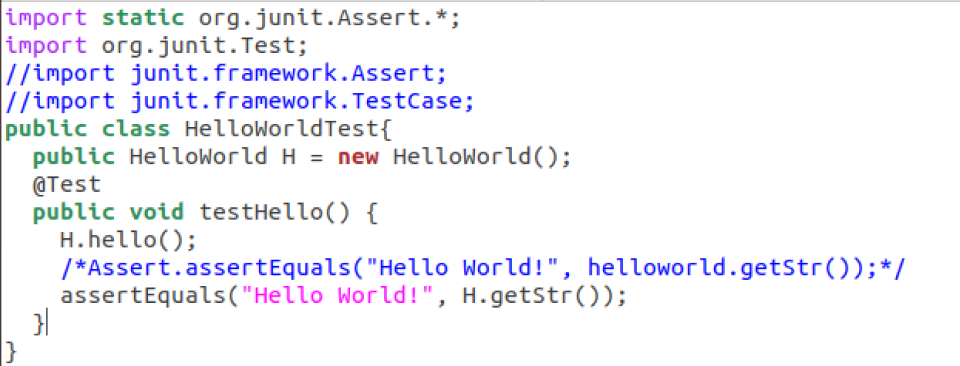

# 实训总结报告  

## 第一阶段  
[【源码】](https://github.com/luji17343080/GridWorld2019/tree/master/%E9%98%B6%E6%AE%B5%E4%B8%80)  
第一阶段主要是这次实训的基本的技术准备，包括`Java`、`ant`以及`sonar runner`的`环境配置`（第一阶段绝大部分时间都被环境配置所占据）以及`简单使用`，在环境配置的过程中会涉及到`vi/vim编辑器`的使用。同时还通过`HelloWorld程序`的编写和`简单计算器`的实现熟悉了一些`java`的基本语法，然后初步接触了`java UI`的一些知识（`Swing框架`）。除此之外，通过编译运行`GridWorld`掌握了终端下`java包含路径`的使用，初步了解了本次实训的基本内容  
### `Java`环境配置及简单使用  
说实话，这一部分环境变量的配置坑了我很久（看似很简单，但会出现莫名其妙的bug，问了好多大佬也没解决，甚至到实训结束还有一些让我疑惑的地方），最后只好使用`ant`（自带`javac`和`java`）以及`Eclipse`（强大的`IDE`）来解决。至于终端下`java`的使用，好像除了`HelloWorld`程序以及第一阶段`GridWorld`项目的运行，我就再也没使用过了，当然，`ant`的使用过程中也会涉及到，无非就是`javac`用于编译程序，`java`用于运行程序。  
`简单计算器`的实现主要是让我加深了对`Java`的熟悉程度，同时也学习了关于`Java UI`的`Swing`框架，还初步了解了`Pattern`库（可以用来定义一个正则规则），具体内容在[自学报告](https://github.com/luji17343080/GridWorld2019)里，这里就不做过多阐述了。  

### `vi/vim编辑器`的使用  
当熟悉了`vi`的指令之后，它确实是相对比较实用的一款`编辑器`，不过现在有`sublime`这样的编辑器，使用起来更加方便，`vi`就显得比较麻烦了，不过作为基于`命令行`的编辑器，还是让喜欢`Linux`的我有很大的使用兴趣的。这一部分的学习在第一阶段的[自学报告](https://github.com/luji17343080/GridWorld2019)里已经描述的十分详细了，主要是`命令模式`和`插入模式`的区分以及基本的`命令行指令`的熟悉。因为不能使用鼠标，所以熟悉显示`文本行数`的命令`":set nu"`、`跳行`命令"`n+、n-等`"以及`复制、移动光标`等其他命令，对于高效地使用`vi`来讲是非常重要的。  

### `ant`环境配置及简单使用  
   - `ant`是将软件`编译`、`测试`、`部署`等步骤联系在一起加以`自动化`的一个工具(与`make`类似)，大多用于Java环境中的软件开发。Ant运行时需要一个`XML文件`(构建文件，类似于`makefile`，只是语法不同而已)，通过调用`target树`，就可以执行各种`tas`k，每个task实现了特定接口对象。由于Ant构建文件为XML格式的文件，所以它很容易维护和书写，而且结构很清晰。同时由于Ant的跨平台性和操作简单的特点，它很容易集成到一些开发环境中去（比如Eclipse）。  
   - ant`环境配置`部分很容易，也没有遇到啥bug，到官网下载`ant安装包`（我用的是`apache-ant 1.10.7`），然后解压到某一目录，在系统环境配置文件中添加`ant绝对路径`的环境变量即可。  
        
   - ant的简单使用：以`HelloWorld`的`build.xml`文件编写为例：主要就是`target`的编写以及各种`java`命令的使用，只要熟悉各种`标签`的使用以及`参数用法`就行了，具体的在[自学报告](https://github.com/luji17343080/GridWorld2019)中有说明。  

        
### `Junit`使用  
`Junit`是一个Java语言的单元测试框架，用来判断程序的执行结果与自己期望的结果是否一致。要知道，通常测试Jave代码的方法是新建一个类，然后在其中创建一个main()函数，在main中编写测试代码。而当遇到代码量很大时，这样会大大的增加测试的复杂度，降低程序员的测试积极性。而Junit则简化了单元测试，写一点测一点，在编写以后的代码中如果发现问题可以较快的追踪到问题的原因，减小回归错误的纠错难度。  
#### `Junit-4`基本语法  
- "@"方法  
   - `@Test`: 测试方法，如果程序的执行能在100毫秒之内完成，则测试通过  
   - `@Ignore`: 忽略方法，暂时不运行此段代码  
   - `@Before`：在test方法之前运行  
   - `@After`: 在test方法之后运行  
- `assertEquals`函数：判断两个参数的值是否相等（注意类型要一致）  
- 一些基本原则  
   - 测试方法前（@Test后面的函数块）必须使用`public void` 进行修饰，不能带任何的参数,且在之前必须跟"@Test"   
   - 习惯上测试类名用"Test"作为后缀，测试方法用"test"作为前缀  
   - 测试类所在的包名必须和被测试类所在的包名保持一致  
  
#### HelloWorld的`Junit测试`  
- 先在官网下载`junit-4.9.jar`包，将其放在HelloWorld.java目录下  
  
  
- 编写`HelloWorldTest.java`（注意junit-3版本和junit-4版本的库函数不一样，所以语法上有差异，我开始在这里进入了一个大坑)  
  
    
- 编译和运行（编译时要包含.jar文件，运行时要包含HelloWorldTest中运用到的库）  
  
  
### `SonarQube`环境配置及简单使用  
   - `SonarQube`的环境配置部分还是遇到一些坑，首先就是`Java`环境的问题，在实验过程中发现有些版本的`JDK`是不支持的，最后使用了`1.8`版本；然后是`sonar`的位数选择，要根据自己电脑的`Linux`系统位数选择合适的版本（我的是`64位`）；最后一点就是修改了`/etc/profile`之后忘记`source`导致环境变量设置失败（不过这一点还是很好发现的）。因为实验给出了`sonar`和`sonar-runner`的安装包，`数据库`也可以使用`sonar`自带的`H2`，所以其他地方基本就没遇到什么问题了。  
   - 在启动了`sonar`之后，有 `sonar-project.properties` 配置文件的情况下运行`sonar-runner`，经常会遇到`http://localhost:9000`不能访问的问题，经过不断的测试，发现出现这个问题有两种情况：一是`9000`端口被占用，这种情况通过`kill`杀掉端口的进程即可；第二种情况也是最坑的情况：虽然`sonar`启动成功了，但`9000`端口进程启动较慢，导致短时间内无法通过`sonar-runner`访问端口，这种情况可以先杀死端口进程，过一会儿再重新`sonar-runner`就行了。  

  
   - `SonarQube`的使用：只需要写一个`sonar-project.properties`配置文件，在配置文件中指定测试项目代码所在的"`目录：projectBaseDir`"、项目的"`唯一标识符：projectKey`"以及项目的"`名字：projectName`"即可。`sonar-project.properties`例子如下：  

        

      例子`sonar-runner`运行结果如下：  
  
        

      `SonarQube`界面如下：  

        

     `SonarQube`用于检测代码的质量，主要从以下几个维度检测代码质量：  

      

      - 代码的复杂度（`Complexity`）：检测代码的复杂程度，包括每个方法（`method`）、每个类（`class`）以及每个文件（`file`）的复杂度  
      - 重复率（`Duplications`）：检测代码的`重复情况`，降低代码的重复能提高运行的效率
      - 注释率（`Comments`）：检测代码中的注释情况，增加注释能提高`代码可读性`
      - 规则遵循程度（`Rules compliance`）：检测程序`潜在的bug`，通过`Issues`给出了代码`潜在bug`，并且非常友好的给出了bug代码的`具体位置`、`内容`以及`修改方法`。通过`sonar runner`的测试，我发现在代码能成功编译、运行的情况下，仍然有许多值得完善的地方（`规范化`）：比如说包名需要小写字母开头、`magic number`的问题以及`缺少默认构造函数`等等，这些都是可能造成`bug`的地方，这让我在以后编写代码的时候  
      - 单元测试覆盖率（`Unit Tests Coverage`）：检测`测试代码`的覆盖`测试类`中的方法率。

## 第二阶段  
[【源码】](https://github.com/luji17343080/GridWorld2019/tree/master/%E9%98%B6%E6%AE%B5%E4%BA%8C)  

第二阶段首先让我学会了`Eclipse`的使用，包括新建`java project`，创建`java class`，打开`project window`，添加`外部jar包`，配置`自动补全`，`编译运行`代码以及导入`junit包`等，让我深刻意识到了一款强大的`IDE`的方便（不过是真的`耗内存`）。相比于第一阶段在终端编译运行`java 类`需要添加包含路径，或者用`ant`时需要编写`build.xml`，`Eclipse`简直太方便了，在添加了必要的`外部jar`之后，不管是`extends`还是`implements`，它都可以帮你自动`import`相应的包，同时`IDE`带来的最显著的好处就是`自动补全`和`边写边调试`了。  

`Part2-Part4`通过`继承GridWorld中已有的类`和`重写父类的方法`实现`Bug`的一些新功能，让我充分熟悉了整个项目的源代码，特别是每个部分的问答题，让我基本上了解了`GridWorld`中每一个类中所有`方法`的作用。而在通过`继承`和`Override`实现新的功能的同时，也让我认识了`java`中描述类的`成员变量`和`方法`的一些关键字，同时区分了它们是否`可继承、可重写`，比如`private`修饰的成员变量是不可继承的，`public`和`protected`修饰的成员变量是可继承的（`protected`不能用于外部包）；`public`修饰的方法是`可继承、可重写`的、`private`修饰的方法是`不可继承、不可重写`的，`final`修饰的方法是`可继承、不可重写`的。  

`Part5`通过实现接口来重新实现`BoundedGrid`和`UnboundedGrid`，让我熟悉了`HashMap`、`ArrayList`和`LinkList`的用法以及他们各自的优缺点  
除此之外，通过给每个类写`Junit`测试文件，让我更加熟悉了`Junit`的使用，而因为这一阶段的代码我都是用`Eclipse`编辑和运行的，所以这一阶段并没有怎么使用`vi`编辑器和`ant`。
## 第三阶段  
[【源码】](https://github.com/luji17343080/GridWorld2019/tree/master/%E9%98%B6%E6%AE%B5%E4%B8%89)  

### 1、`Bmp图像`处理
 
#### `myRead`函数  
这一部分为利用`二进制流`读取`Bitmap位图`文件，虽然在Java中存在已有的`API接口`，看上去这一部分并不"与时俱进"，但这让我对于`位图读取原理`的理解更加的深刻。这一部分的知识点大致如下：
   - BMP：位图`BitMaP`的缩写，也称为`DIB`（与设备无关的位图）是微软视窗图形子系统（Graphics Device Interface）内部使用的一种位图图形格式，它是微软视窗平台上的 一个简单的图形文件格式。
   - Bitmap`文件结构`：
      - `位图头`： 保存位图文件的总体信息  
      这部分是`识别信息`，占`14字节`应用程序会先读取这一部分数据以确保读取的文件为`位图文件`并且`没有损坏` 

        |字节|属性|
        |:---------|:--------|
        |#0-1|保存位图文件的标识符，这两个字节的典型数据是BM|
        |#2-5|使用一个dword保存位图文件大小|
        |#6-9|保留部分，留做以后的扩展使用,对实际的解码格式没有影响|
        |#10-13|保存位图数据位置的地址偏移，也就是起始地址|
      - `位图信息`： 保存位图图像的详细信息  
      屏幕上`显示图像`会根据这一部分的信息  
      
        |字节	|属性|
        |:------|:-----|
        |#14-17	|定义用来描述`影像区块`（BitmapInfoHeader）的大小|
        |#18-21	|保存`位图宽度`（以像素个数(`int`)表示）|
        |#22-25	|保存`位图高度`（以像素个数(`int`)表示）|
        |#26-27	|保存所用`彩色位面`的个数（不常使用）|
        |#28-29	|保存每个像素的位数，它是图像的`颜色深度`。常用值是1、4、8（灰阶）和24（彩色）|
        |#30-33	|定义所用的压缩算法。允许的值是0、1、2、3、4、5，见下表|
        |#34-37	|保存`图像大小`。这是原始 （:en:raw）位图数据的大小，不要与文件大小混淆。|
        |#38-41	|保存图像`水平方向分辨率`|
        |#42-45	|保存图像`竖值方向分辨率`|
        |#46-49	|保存所用`颜色数目`|
        |#50-53	|保存所用重要颜色数目。当每个颜色都重要时这个值与颜色数目相等|
        
        |压缩算法的值	|定义|
        |:-------|:--------|
        |0	     |没有压缩（也用BI_RGB表示
        |1	     |行程长度编码 8位/像素（也用BI_RLE8表示）
        |2	     |行程长度编码4位/像素（也用BI_RLE4表示）
        |3	     |Bit field（也用BI_BITFIELDS表示）
        |4	     |JPEG图像（也用BI_JPEG表示）
        |5	     |PNG图像（也用BI_PNG表示）
      - `调色板`： 保存所用颜色的定义  
      每个像素用一个或多个字节表示，`调色板`就是定义这些值所表示的颜色。`位图文件`一般用`RGB`模型，每种颜色由不同强度（0-255）的红色(R)、绿色(G)和蓝色(B)表示  
      - `位图数据`： 保存一个又一个像素的实际图像  
      这部分`逐个像素`表示图像。像素是从下到上、从左到右保存的。每个像素使用一个或者多个字节表示。如果一个图像水平线的字节数不是4的倍数，这行就使用空字节补齐，通常是ASCII码0。  
      在实现过程中，通过一个`int数组pixels[]`存储所有的像素，然后将每个像素的RGB值的字节组转换为`int`之后作为`像素数组`的元素，最后通过调用库函数`Toolkit.getDefaultToolkit().createImage(new MemoryImageSource(width, height, pixels, 0, width))`将像素数组转换一个`Image`  

  `myRead函数代码如下`：
  ```java
    // 利用二进制流读取Bitmap位图文件
    @Override
    public Image myRead(String filepath) {
        Image image;
        try {
        	File infile = new File(filepath);
            FileInputStream fi = new FileInputStream(infile);
            
            // 位图头和位图信息总共 54 字节
            byte fourBytes[] = new byte[FOUR];
            byte twoBytes[] = new byte[TWO];
            // 字节 #0-13 保存位图头
            // 字节 #14-17 保存影像区块大小
            fi.skip(18);
            
            // 字节 #18-21 保存位图宽度（以像素个数表示）
            fi.read(fourBytes);
            int width = bytesToInt(fourBytes);
            
            // 字节 #22-25 保存位图高度（以像素个数表示）。
            fi.read(fourBytes);
            int height = bytesToInt(fourBytes);
           
            //  字节 #28-29 保存每个像素的位数，它是图像的颜色深度。常用值是1、4、8（灰阶）和24（彩色）。
            fi.skip(2);
            fi.read(twoBytes);
           
            // 字节 #34-37    保存图像大小。这是原始位图数据的大小，不要与文件大小混淆
            fi.skip(4);
            fi.read(fourBytes);
            int imageSize = bytesToInt(fourBytes);

            // 字节 #38-53 像素对齐
            // 若像素使用的字节不是4的倍数，则用空白填充(彩图为24位，为4的倍数，不需要填充)
            fi.skip(16);
            // 填充的位数
            int paddingSize = ((imageSize / height) - width * THREE);
            if (paddingSize == FOUR) {
            	paddingSize = 0;
            }
            // 像素数组：存放所有像素
            int pixels[] = new int[height * width];
            // 存放每个像素的RGB值
            byte rgb[] = new byte[imageSize];
                
            fi.read(rgb);
            int index = 0;
            for (int j = 0; j < height; j++) {
                for (int i = 0; i < width; i++) {
                    int t = width * (height - j - 1) + i;
                    // 像素的RGB值
                    pixels[t] = (COLORCHANNAL & FF) << 3 * EIGHT
                            | (((int)rgb[index + TWO] & FF) << 2 * EIGHT)
                            | (((int)rgb[index + 1] & FF) << EIGHT)
                            | (int)rgb[index] & FF;
                    index += THREE;
                }
                index += paddingSize;
            }
            // 从像素数组转换为java.awt.Image
            image = Toolkit.getDefaultToolkit().createImage(new MemoryImageSource(  
                       width, height, pixels, 0, width)); 
            fi.close();
            return image;
            
        } catch (Exception e) {
            //e.printStackTrace();
        }
        return null;
    }
  ```
#### `myWrite`函数  
这一部分通过`BufferedImage`创建并保存一个`指定宽高`的`RGB图`，再通过调用`getGraphics()`和`drawImage`方法将`Image`转换为`BufferedImage`，然后通过调用`ImageIO`类中的`write`方法将`BufferedImage`转化成指定的图片格式（`jpg、bmp、png等`）之后写入指定的文件中  

  `myWrite函数代码如下`：
   ```java
    // 调用Java的API把处理完的图像保存为BMP格式图像
    @Override
    public Image myWrite(Image image, String filepath){
        try {
            int width = image.getWidth(null);
            int height = image.getHeight(null);
            File imageFile = new File(filepath);
            BufferedImage bufImage = new BufferedImage(width, height, BufferedImage.TYPE_INT_BGR);
            bufImage.getGraphics().drawImage(image, 0, 0, width, height, null);
            ImageIO.write(bufImage, "bmp", imageFile);
            return image;
        } catch (Exception e) {
            //e.printStackTrace();
        }
        return null;
    }
   ```
#### `ImageProcesesor`  
这一部分通过调用java中已有的`API`提取彩色图像（`RGB图像`）的各个`彩色通道`以及将`彩色图像`转换为`灰度图`
- `色彩通道`：每个彩色图像的像素都是由3个色彩通道组成的（加`Alpha`通道为4个），分别为`R`、`G`、`B`。如果是`24位`的`Bitmap`（彩色），其每一个色彩通道就用`一个字节`存储（`3*8`），所以取值范围为`[0, 255(2^8-1)]`。`提取色彩通道`就是将彩图的每个像素的`RGB`值分别提取出来，如提取`R通道`，就是将原来图像的每一个像素的`R值`提取出来，形成新的`RGB`值为`（R, 0, 0）`的像素，组合成新的图像就表示将`R通道`提取出来了
- `灰度图`：指每个像素只有一个`采样颜色`的图像，这类图像通常显示为从`最暗黑色`到`最亮白色`的灰度，尽管理论上这个采样可以任何颜色的不同深浅，甚至可以是不同亮度上的不同颜色。灰度图像与黑白图像不同，在计算机图像领域中黑白图像只有黑白两种颜色，灰度图像在黑色与白色之间还有许多级的颜色深度。但是，在数字图像领域之外，"黑白图像"也表示"灰度图像"，例如灰度的照片通常叫做”黑白照片”。
用于显示的灰度图像通常用每个采样像素 `8 位的非线性尺度`来保存，这样可以有 `256 级灰度`（[0, 255]）。这种精度刚刚能够避免可见的条带失真，并且非常易于编程。  
- `彩图转换为灰度图`：目前有几种转化方式，常用的是`NTSC`推荐的公式：
  > I = 0.299 * R + 0.587 * G + 0.114 *B  
  
  然后将三个色彩通道的值改为上述计算结果值即可。
- `API`
   - `RGBImageFilter`类: 过滤出`RGB图`某个色彩通道的值；重写方法`filterRGB`过滤`某一通道`，重写`showChanelR`方法，读入一个`Image`返回一个过滤了`R通道`的`Image`  
   - `Toolkit.getDefaultToolkit().createImage(ImageProducer producer)`：从像素数组转换成`java.awt.image`  
    
提取`R通道`代码如下（其他大同小异）：
```java
  // 红色通道
    class RedFilter extends RGBImageFilter {
        public RedFilter() {
            canFilterIndexColorModel = true;
        }
        
        @Override
        // arg0、arg1和arg2分别为B、G、R值
        public int filterRGB(int arg0, int arg1, int arg2) {
            return (arg2 & FILTERRED);
        }
    }
    
    // 提取并且显示彩色图像红色通道
    @Override
    public Image showChanelR(Image arg0) {
    	RedFilter red = new RedFilter();
        return Toolkit.getDefaultToolkit().createImage(new FilteredImageSource(arg0.getSource(),red));
    }
```
### 2、`深搜`解决`Maze`问题  
这一部分用`栈`实现树的`DFS`，来解决`Maze`问题。`无环路`的`Maze`在数据结构上表现为`一棵树`，用`深搜`可以找到解，`DFS`沿着树的`深度`遍历树的节点（`Maze`的空位置），当节点v的所有边都已被探寻过，搜索将`回溯`到发现节点v的那条边的起始点（迷宫的岔路），直到走完源节点可以到达的所有位置为止。  

`DFS`基本步骤：
- 先将树的所有节点标记为`"未访问"`状态  
- 输出起始节点，将起始节点标记为`"已访问"`状态  
- 将起始节点`入栈`
- 当栈非空时重复执行以下步骤：
   - a. 取当前`栈顶`节点
   - b. 如果当前栈顶节点是结束节点（迷宫出口），输出该节点，结束搜索
   - c. 如果当前栈顶节点存在`"未访问"`状态的`邻接节点`，则选择一个未访问节点（`右边优先`），置为`已访问`状态，并将它入栈，继续步骤a
   - d. 如果当前栈顶节点不存在`"未访问"`状态的邻接节点，则将栈顶节点出栈，继续步骤a  

`MazeBug`实现过程：  

1、先修改`Bug`可移动的方向为`东南西北`四个方向，通过重写`getValid`方法实现：
```java
public ArrayList<Location> getValid(Location loc) {
        Grid<Actor> gr = getGrid();
        if (gr == null) {
            return null;
        }
        ArrayList<Location> valid = new ArrayList<Location>();
        // 遍历四个方向
        for (int i = 0; i < FOUR; i++) {
            Location neighborLoc = loc.getAdjacentLocation(getDirection() + i * Location.RIGHT);
            if (gr.isValid(neighborLoc)) {
                Actor a = gr.get(neighborLoc);
                // 遇到终点红色石头停止
                if (a instanceof Rock && a.getColor().equals(Color.RED)) {
                    isEnd = true;
                    valid.add(neighborLoc);
                    break;
                } else if (a == null){
                    valid.add(neighborLoc);
                }
            }
        }
        return valid;
    }
```  

2、再通过重写`canMove`方法寻找下一个可移动的位置`next`（`右边优先`：通过寻找`"移动方向"`和`当前位置指向可移动位置方向`的`"最大夹角"`实现）
```java
    /* 获得Bug可以移动到的下一个位置next */
    @Override
    public boolean canMove() {
    	// 获得当前位置，并得到下一个可移动的位置
    	Location location = getLocation();
        ArrayList<Location> nextLocations = getValid(location);
        Grid<Actor> gr = getGrid();
        if (gr == null) {
            return false;
        } else if (nextLocations.size() == 0) {
            return false;
        } else {
            int index = 0;
            int max = 0;
            for (Location loc : nextLocations) {
                // 遇到石头寻找下一位置
                if (gr.get(loc) instanceof Rock) {
                    isEnd = true;
                    next = getLocation();
                    return true;
                }
                // 位置方向
                int locDirection = getLocation().getDirectionToward(loc);
                // bug移动方向
                int moveDirection = this.getDirection();
                int dir = getTurnDirection(locDirection, moveDirection); 
                
                if (directions[dir] > directions[max]) {
                    max = index;
                }
                index++;
            }
            next = nextLocations.get(max);
            return true;
        }
    }
```  
  
3、最后通过重写`act`方法实现`DFS`（根据前面提到的步骤）：其中栈`crossLocation`存储`已访问`的节点
```java
    public void act() {
      boolean willMove = canMove();
      if (isEnd == true) {
        	//to show step count when reach the goal		
			  if (hasShown == false) {
				String msg = stepCount.toString() + " steps";
				JOptionPane.showMessageDialog(null, msg);
				hasShown = true;
			  }
      } else if (willMove) {
            // 如果下一个位置能移动，则将可移动的位置加入到crossLocation中
            ArrayList<Location> canMoveLocations = new ArrayList<Location> ();
            canMoveLocations.add(getLocation());
            crossLocation.push(canMoveLocations);
            // 同时将last设置为当前位置
            last = getLocation();
            
            if (getValid(getLocation()).size() > 1) {
                // 两个位置的方向 
                int locDirection = getLocation().getDirectionToward(next);
                // bug的移动方向
                int moveDirection = this.getDirection();
                int dir = getTurnDirection(locDirection, moveDirection);
                directions[dir]++;
                nowDir = dir;
            }            
            move();
            //increase step count when move
            stepCount++;
            
        } else {
        	// 回溯
            next = last;
            
            if (getValid(getLocation()).size() > 1) {
            	directions[nowDir]--;
            }
            
            move();
            // 回溯过程步数仍然增加
            stepCount++;
            // 弹出经过位置的栈顶
            crossLocation.pop();
            // 不断寻找上一位置
            if (crossLocation.peek().size() != 0) {
                last = crossLocation.peek().get(0);
            }
            
        }
    }
```
### 3、`BFS`、`A*`解决`N-Puzzle`问题
这一部分使用`盲目搜素（BFS）`以及`启发式搜索(A*)`解决`N数码问题`，通过比较两种算法解决问题所需要搜索的节点数目（对应`搜索时间`）来分析两者的性能。并通过优化`A*`的`估计值`计算方法来展示利用问题领域的知识，`有信息引导`的搜索策略对`搜索效率`的提升  

`N-Puzlle`（N = M * M - 1, M为边长）问题：简单来讲就是拼图游戏，只不过拼图块为`数字`，且有一块为`空白块`而已。解决`N-Puzzle`问题，就是通过不断移动`空白块`到`相邻位置`，使结果与预期相符（一般为`从左到右`、`从上到下`依次增大的顺序）即可。  

`N-Puzzle`问题`是否存在解`的判定：将`初始状态`和`目标状态`的数码及顺序通过一维数组表示，若两数组的`"前大值数"`同为`奇`或者同为`偶`，则有解，否则无解。前大值数(为了方便，我自己定义的叫法)：`数码数组`中每一个数码（`除0外`）的前面比它大的数码的数目之和，如目标状态{1, 2, 3, 4, 5, 6, 7, 8, 0}的`前大值数`是0，为偶；初始状态{1, 0, 3, 4, 2, 6, 7, 5, 8}的`前大数值`为"0+0+0+0+2+0+0+2+0=4"，也为偶，因此该初始状态有解；若将上面初始状态的1和3交换，`前大数值`就变为了5，为`奇`，就无解。  

#### 盲目搜索：`BFS`
这一部分通过广度优先搜索解决`N数码`问题：将`初始状态`作为`根节点`，`相邻状态`作为`子节点`构建`节点树`，`逐层遍历`直到找到`目标状态`的节点为止。  

**基本步骤：**  

先定义两个储存节点的表：`openList`和`closeList`，前者用来存储`未被访问`的节点，后者用来存储`已被访问`的节点，接着按以下步骤搜索：
- 将`起始节点`放入一个`openList`中（`树根`）
- 如果`openList`为空，则搜索失败，问题无解；否则重复以下步骤：
   - 访问`openList`中的第一个节点v，若v为`目标节点`，则搜索成功，退出
   - 从`openList`中`删除`节点v，放入`closeList`中，表示节点v`已被访问`
   - 得到节点v的所有`相邻节点`（`子节点`）：`相邻`的意义在于移动当前`空百格`所能得到的`状态`
   - 将所有与节点v`相邻且未被访问`（`closeList`中不存在）的节点添加到`openList`中  
  
`BFSearch`示意图：  

    
  
`BFSearsh`代码实现如下：其中`JigsawNode`定义了"拼图"的`节点状态`（`数组`依次存储每个位置的`数码`）和`节点操作`（`空白格`的移动等），`setBeginJnode`和`setEndJNode`分别设置`初始状态`和`目标状态`，`getPath()`能获得当前的`解路径`（存到`solutionPath`中）。
```java
public boolean BFSearch(JigsawNode bNode, JigsawNode eNode) {
    	// 用以存放某一节点的邻接节点
    	Vector<JigsawNode> adjacentJNodes = new Vector<JigsawNode>();
    	setBeginJNode(bNode);
    	setEndJNode(eNode);
    	// 将起始节点插入openList中
    	this.openList.addElement(beginJNode);		
    	// 如果openList为空，则搜索失败，问题无解;否则循环直到求解成功
    	while (this.openList.isEmpty() != true) {
    		// a. 访问openList中的第一个节点v，将其设置为currentJNode，若v为目标节点，则搜索成功，设置完成标记isCompleted为true，找到解路径，退出。
    		currentJNode = this.openList.elementAt(0);
    		searchedNodesNum++;
    		// 记录并显示搜索过程
    		//System.out.println("Searching.....Number of searched nodes:" + this.closeList.size() + "   Current state:" + this.currentJNode.toString());	
    		if (currentJNode.equals(endJNode)){
    			this.getPath(); // 修改slutionPath
    			break;
   			}
    				
  			// b. 从openList中删除节点v,并将其放入closeList中，同时将搜索节点数加1			
    		this.openList.removeElementAt(0);
    		this.closeList.addElement(currentJNode);

    		// 得到某一节点的所有相邻节点（上下左右）
    		JigsawNode tempJNode2;
    		for(int i = 0; i < 4; i++){
    			tempJNode2 = new JigsawNode(currentJNode);
    			if(tempJNode2.move(i) && !this.closeList.contains(tempJNode2) && !this.openList.contains(tempJNode2)) {
    				adjacentJNodes.addElement(tempJNode2);
    			}
    		}
    		// c. 将所有与v邻接且未曾被访问的节点插入openList中
    		while (!adjacentJNodes.isEmpty()) {
    			this.openList.addElement(adjacentJNodes.elementAt(0));
    			adjacentJNodes.removeElementAt(0);
    		}
    	}
    	System.out.println("Jigsaw BFSearch Result:");
        System.out.println("Begin state:" + getBeginJNode().toString());
        System.out.println("End state:" + getEndJNode().toString());
        System.out.println("Solution Path: ");
        System.out.println(getSolutionPath());
        System.out.println("Total number of searched nodes:" + getSearchedNodesNum());
        System.out.println("Depth of the current node is:" + getCurrentJNode().getNodeDepth());
		return this.isCompleted();		
    }
```
  
`RunnerPart1`测试结果如下：  
  
    
  
#### 启发式搜索：`A*`
这一部分不用重新实现`A*`算法，只是需要优化`估计值`计算方法（`估价函数`）。`启发式搜索`的核心就是通过问题已有的信息来设计`估价函数`，得出每一个搜索节点的`估计值`，然后根据`估计值`对`待搜索节点`进行`搜索排序`，与`盲目搜索`的`固定顺序搜索`相比，当`估计值`计算方式得当时，能大大降低`搜索范围`，从而提高`搜索效率`。  
  
#### 估价函数
`估价函数f(n)`用来计算从`初始状态`经过`状态n`，再到达`目标状态`的估计代价，`f(n)越小`，代表该节点越接近`目标状态`，应当被优先搜索。而估价函数的关键就在于找到合适的`估价方法`，我选择的估价方法如下：
- 后续节点不正确的数码个数`s`
- 所有 放错位的数码与其正确位置的`欧氏距离`(直线距离) 之和`distance`
- 所有 `放错位的数码` 个数`n`
- 当前节点n的`节点深度d`（通过调用`getNodeDepth()`方法获得）  

调整以上估价方法的权重，最终得到`f(n) = s*6 + distance*10 + n + d`  
  
重写的`estimateValue(JigsawNode jNode)`方法代码如下：  
  
```java
@Override
    public void estimateValue(JigsawNode jNode) {
		// 后续节点不正确的数码个数
		int s = 0; 
		
		// 拼图的维数
		int dimension = JigsawNode.getDimension();
		
		for (int index = 1; index < dimension * dimension; index++) {
			// 计算水平方向后续节点不正确的数码个数
			if (jNode.getNodesState()[index] + 1 != jNode.getNodesState()[index + 1]) {
				s++;
			}
		}
		
		for (int index = 1; index < dimension * (dimension - 1); index++) {
			// 计算垂直方向后续节点不正确的数码个数
			if (jNode.getNodesState()[index] + dimension != jNode
					.getNodesState()[index + dimension]) {
				s++;
			}
		}
		// 所有节点与其正确位置的欧氏距离之和
		int distance = 0;
		for (int i = 1; i <= dimension * dimension; i++) {
			// 计算欧氏距离
			if (jNode.getNodesState()[i] != i && jNode.getNodesState()[i] != 0) {
				// 正确位置行数
				int rightRow = (jNode.getNodesState()[i] - 1) / dimension;
				// 正确位置列数
				int rightCol = (jNode.getNodesState()[i] - 1) % dimension;
				// 当前行数
				int nowRow = (i - 1) / dimension;
				// 当前列数
				int nowCol = (i - 1) % dimension;
				// 直线距离
				distance += Math.abs(rightRow - nowRow) + Math.abs(rightCol - nowCol);
			}
		}	
		
		// 所有放错位的数码的个数
		int n = 0;
		for (int i = 1; i <= dimension * dimension; i++) {
			// 放错位的数码的个数总和
			if (jNode.getNodesState()[i] != i && jNode.getNodesState()[i] != 0) {
				n++;
			}
		}
		/* 启发式函数估计值 */
		jNode.setEstimatedValue(s*6 + distance*10 + n + jNode.getNodeDepth());
	}
```  

`RunnerPart2`测试结果如下：  

  
  
  

`main`脚本运行结果如下：  

  
