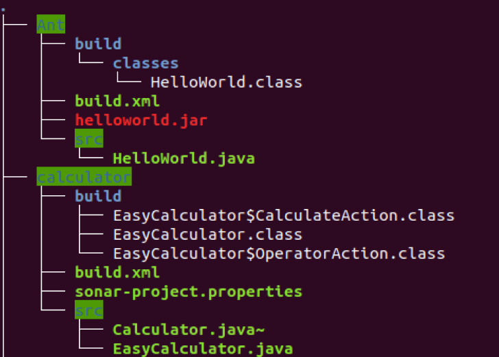
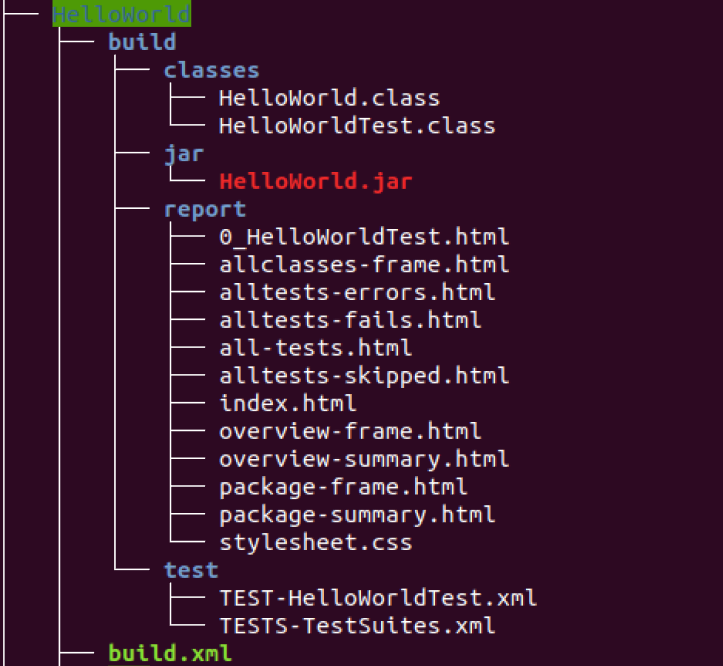
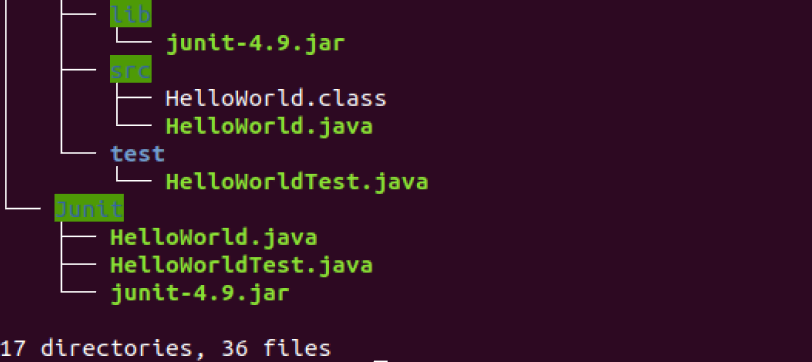

## 文件说明  
- 文件树  
  
  
  

  
- Ant文件夹：此文件夹用于HelloWorld的ant测试  
- Junit文件夹：此文件单独对HelloWorld进行单元测试（不用ant）  
- HelloWorld文件夹：此文件夹对HelloWorld用ant的方式进行测试（包含单元测试）  
- calculator文件夹：简单计算器的源代码、sonar配置文件和build.xml  