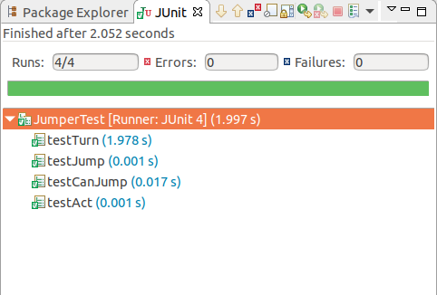

## Jumper测试文档
### 1.turn函数测试
这部分测试比较简单，创建一个默认的`Jumper实例`，调用`turn函数`，看turn之后的`jumper方向值`是否为`45`即可，单元测试代码如下：  
```java
/*turn测试*/
public void testTurn() {
    ActorWorld world = new ActorWorld();
    Jumper a = new Jumper(Color.RED);
    world.add(new Location(2,0), a);
    a.turn();
    assertEquals(Location.NORTHEAST, a.getDirection());
}
```
### 2.jump函数测试
这一部分测试也相对容易，创建一个默认的`Jumper实例`，设置其位置，调用`jump函数`，看`jump`之后的位置的`行数`和`列数`是否符合规则即可，单元测试代码如下：  
```java
/*单独jump测试*/
public void testJump() {
    ActorWorld world = new ActorWorld();
    Jumper a = new Jumper(Color.RED);
    world.add(new Location(4,4), a);
    a.jump();
    /*jump后行为2，列为4*/
    assertEquals(2, a.getLocation().getRow());
    assertEquals(4, a.getLocation().getCol());
}
```
### 3.canJump函数测试  
具体的就不说明了，看代码注释吧：  
```java
    /*canJump函数测试*/
    public void testCanJump() {
    	ActorWorld world = new ActorWorld();
    	Jumper a = new Jumper(Color.RED);
    	world.add(new Location(4,4), a);
    	/*下一目标为空或者flower时canJump*/
    	boolean tmp = a.canJump();
    	assertTrue(tmp);
    	world.add(new Location(2,4), new Flower());
    	tmp = a.canJump();
    	assertTrue(tmp);
    	/*下一位置为Rock、Jumper、Bug或者Grid边界时不能jump*/
    	Jumper b = new Jumper();
    	Jumper c = new Jumper();
    	Jumper d = new Jumper();
    	Jumper e = new Jumper();
    	/*rock*/
    	world.add(new Location(5,5), b);
    	world.add(new Location(3,5), new Rock());
    	tmp = b.canJump();
    	assertFalse(tmp);
    	/*jumper*/
    	world.add(new Location(5,6), c);
    	world.add(new Location(3,6), new Jumper());
    	tmp = c.canJump();
    	assertFalse(tmp);
    	/*bug*/
    	world.add(new Location(5,7), d);
    	world.add(new Location(3,7), new Bug());
    	tmp = d.canJump();
    	assertFalse(tmp);
    	/*grid边界*/
    	world.add(new Location(1,5), e);
    	tmp = e.canJump();
    	assertFalse(tmp);
    }
```

### 4.act函数测试  
这一部分与其说是对`act函数`的测试，不如说对`show`的测试，因为如果单独对`act`函数进行测试就相对比较容易，因为只有一个动态的`actor`。而就像设计文档里面提到的，当有多个`actor`“争抢”位置时，就要考虑到优先级的问题了。（不过宿舍大佬说这一部分的测试没必要这么麻烦，因为只是对`act函数`的测试，当调用一个act函数时，一定会产生一个`jump`或者`turn`结果，至于说优先级的问题，应该是`show`中用队列或者是`for循环`产生的逻辑）。因此，就简单的对一个`jumper`进行测试了：若在`jumper`的下一移动位置上为`flower`时，`act`的结果为`jump`、当下一位置为`jumper`、`rock`、`bug`或者`grid边界`时，`act`的结果为`turn`。因此，`act`的简单测试其实就是对`jump`和`turn`的测试。
```java
    public void testAct() {
        ActorWorld world = new ActorWorld();
        /*act测试1：遇到flower和空白:act调用jump*/
        Jumper a = new Jumper(Color.RED);
        world.add(new Location(4,4), a);
        a.act();
        assertEquals(2, a.getLocation().getRow());
        assertEquals(4, a.getLocation().getCol());
        
        Flower f = new Flower();
        world.add(new Location(0,4), f);
        a.act();
        assertEquals(0, a.getLocation().getRow());
        assertEquals(4, a.getLocation().getCol());
        
        /*act测试2：遇到rock、jumper、bug、边界调用turn*/
        Jumper b = new Jumper();
    	Jumper c = new Jumper();
    	Jumper d = new Jumper();
    	Jumper e = new Jumper();
    	/*rock*/
    	world.add(new Location(5,5), b);
    	world.add(new Location(3,5), new Rock());
    	b.act();
    	assertEquals(Location.NORTHEAST, b.getDirection());
    	/*jumper*/
    	world.add(new Location(5,6), c);
    	world.add(new Location(3,6), new Rock());
    	c.act();
    	assertEquals(Location.NORTHEAST, c.getDirection());
    	/*bug*/
    	world.add(new Location(5,7), d);
    	world.add(new Location(3,7), new Bug());
    	d.act();
    	assertEquals(Location.NORTHEAST, d.getDirection());
    	/*grid边界*/
    	world.add(new Location(1,5), e);
    	e.act();
    	assertEquals(Location.NORTHEAST, e.getDirection());
    	
    	/*act测试3：遇到jumper、bug时的优先级测试...*/
    	
    }
```  

### 5.在Eclipse上的测试结果如下
  